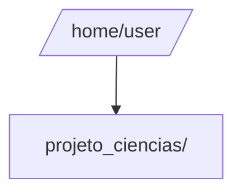
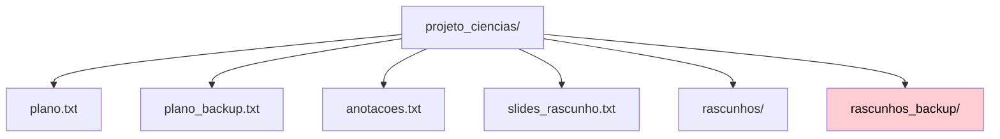
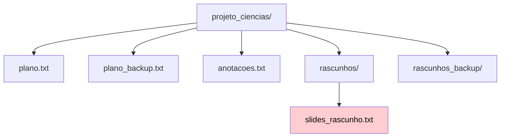
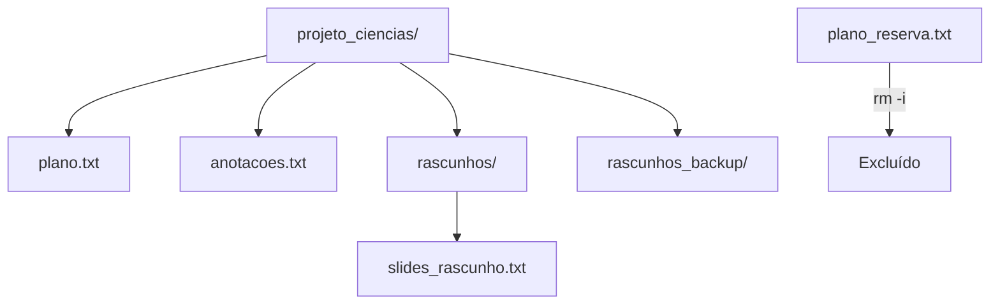
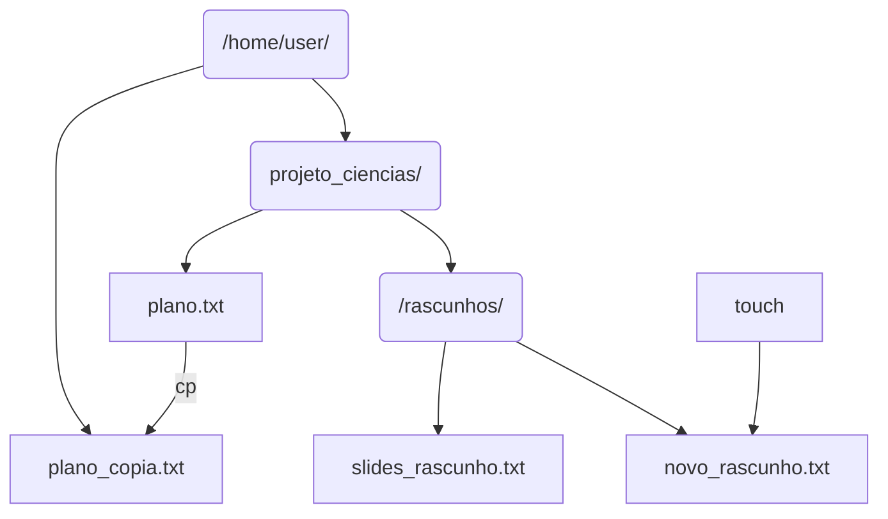

# Organizando um Projeto de Ciências
Você faz parte de um grupo escolar preparando uma apresentação sobre ecossistemas para a feira de ciências. Cada membro enviou arquivos (anotações, rascunhos, slides), mas eles estão desorganizados. Sua tarefa é usar o terminal Linux para:
- Organizar arquivos em pastas específicas (ex.: rascunhos, versão final).
- Criar backups de documentos importantes.
- Renomear arquivos para clareza.
- Remover rascunhos desnecessários.

## Objetivos
- Usar `rm`, `cp` e `mv` para gerenciar arquivos e diretórios em um projeto escolar.
- Entender o impacto de cada comando com um contexto realista de organização.
- Visualizar mudanças no sistema de arquivos com diagramas de árvore.

## Conceitos-Chave
- **Remoção (`rm`)**: Exclui arquivos (ex.: `rm rascunho.txt`) ou pastas com conteúdo (`rm -r pasta`). Não há lixeira, então use com cuidado!
- **Cópia (`cp`)**: Duplica arquivos (ex.: `cp slides.txt slides_backup.txt`) ou pastas (`cp -r rascunhos rascunhos_copia`).
- **Movimento/Renomeação (`mv`)**: Move arquivos para outra pasta (ex.: `mv slides.txt final/`) ou renomeia (ex.: `mv slides.txt slides_v1.txt`).
- **Opções**:
  - `-r` (recursivo): Aplica o comando a pastas e seu conteúdo.
  - `-i` (interativo): Pede confirmação antes de agir (ex.: `rm -i arquivo.txt`).
- **Caminhos**:
  - **Absoluto**: Começa da raiz (ex.: `/home/usuario/projeto/slides.txt`).
  - **Relativo**: Relativo ao diretório atual (ex.: `projeto/slides.txt`).

## Comandos Essenciais
- **Novos**: `rm` (remover), `cp` (copiar), `mv` (mover/renomear).
- **Revisão**: `ls` (listar), `cd` (navegar), `pwd` (localização), `mkdir` (criar pasta), `touch` (criar arquivo), `cat` (ver conteúdo).


## Passo 1: Configurar o Projeto
Você recebeu arquivos do grupo, mas eles estão bagunçados. Vamos criar uma pasta para organizá-los.
1. Abra o terminal. Confirme que está no diretório home (`~`):
   ```
   pwd
   ```
   Saída: `/home/user`.
2. Crie uma pasta chamada `projeto_ciencias/`:
   ```
   mkdir projeto_ciencias/
   ```
3. Entre na pasta:
   ```
   cd projeto_ciencias/
   ```



<!-- **Pergunta**: Por que criar uma pasta específica ajuda a manter o projeto organizado? -->

## Passo 2: Criar Arquivos do Projeto
Seu grupo enviou três arquivos: anotações, um plano inicial e um rascunho de slides.
1. Crie os arquivos:
   ```
   touch plano.txt anotacoes.txt slides_rascunho.txt
   ```
2. Liste para confirmar:
   ```
   ls
   ```
   Saída: 
   ```
   anotacoes.txt plano.txt slides_rascunho.txt
   ```
3. Adicione texto ao `plano.txt`:
   ```
   echo "Apresentação sobre ecossistemas" > plano.txt
   ```
4. Veja o conteúdo:
   ```
   cat plano.txt
   ```


<!-- **Pergunta**: O que `touch` faz? Como `echo` adiciona texto a um arquivo? -->

## Passo 3: Fazer Backup com `cp`
O `plano.txt` é importante, então vamos criar um backup antes de editá-lo.
1. Copie o arquivo:
   ```
   cp plano.txt plano_backup.txt
   ```
2. Liste os arquivos:
   ```
   ls
   ```
   Saída: 
   ```
   anotacoes.txt plano.txt plano_backup.txt slides_rascunho.txt
   ```
3. Confirme o conteúdo do backup:
   ```
   cat plano_backup.txt
   ```

**Diagrama**: O diagrama mostra `plano_backup.txt` como uma cópia de `plano.txt`, com uma seta indicando a ação `cp`.


<!-- **Experimente**: Copie `anotacoes.txt` para `anotacoes_copia.txt` e use `cat` para verificar. -->

## Passo 4: Organizar Rascunhos em uma Pasta
Os rascunhos devem ir para uma pasta separada.
1. Crie uma pasta `rascunhos`:
   ```
   mkdir rascunhos
   ```
2. Faça um backup da pasta (ainda vazia) para praticar:
   ```
   cp -r rascunhos rascunhos_backup
   ```
3. Liste:
   ```
   ls
   ```
   Saída: 
   ```
   anotacoes.txt plano.txt plano_backup.txt rascunhos rascunhos_backup slides_rascunho.txt
   ``` 



<!-- **Pergunta**: Por que `-r` é necessário para copiar pastas? O que aconteceria sem ele? -->

## Passo 5: Mover Arquivos com `mv`
Vamos mover `slides_rascunho.txt` para a pasta `rascunhos`.
1. Mova o arquivo:
   ```
   mv slides_rascunho.txt rascunhos/
   ```
2. Entre em `rascunhos` e verifique:
   ```
   cd rascunhos
   ls
   ```
   Saída: 
   ```
   slides_rascunho.txt
   ```
3. Volte para `projeto_ciencias/`:
   ```
   cd ..
   ```



<!-- **Experimente**: Mova `anotacoes.txt` para `rascunhos` e liste o conteúdo de `rascunhos`. -->

## Passo 6: Renomear com `mv`
O nome `plano_backup.txt` não é claro. Vamos renomeá-lo.
1. Renomeie o arquivo:
   ```
   mv plano_backup.txt plano_reserva.txt
   ```
2. Liste:
   ```
   ls
   ```
   Saída deverá conter: 
   ```
   plano.txt plano_reserva.txt rascunhos rascunhos_backup
   ```

<!-- **Pergunta**: Como `mv` funciona para renomear? Como é diferente de mover para uma pasta? -->

## Passo 7: Remover Arquivos com `rm`
Decidimos que `plano_reserva.txt` não é necessário, pois temos o original.
1. Remova com confirmação:
   ```
   rm -i plano_reserva.txt
   ```
   Digite `y` para confirmar.
2. Liste:
   ```
   ls
   ```
   Saída: 
   ```
   plano.txt rascunhos rascunhos_backup
   ```

**Diagrama**: O diagrama remove `plano_reserva.txt`, com uma nota para `rm -i`.



**Atenção**: Use `rm -i` para evitar erros irreversíveis!

## Passo 8: Remover uma Pasta com `rm`
A pasta `rascunhos_backup` está vazia e não precisamos dela.
1. Remova a pasta:
   ```
   rm -ri rascunhos_backup
   ```
   Confirme com `y`.
2. Liste:
   ```
   ls
   ```
   Saída: 
   ```
   plano.txt rascunhos
   ```


<!-- **Pergunta**: Por que `-r` é necessário para excluir pastas? -->

## Passo 9: Usar Caminhos
Vamos adicionar um novo rascunho e fazer um backup fora do projeto.
1. Crie um arquivo em `rascunhos` com um caminho relativo:
   ```
   touch rascunhos/novo_rascunho.txt
   ```
2. Copie `plano.txt` para o diretório  `home` com um caminho absoluto:
   ```
   cp plano.txt ~/plano_copia.txt
   ```
3. Verifique no home:
   ```
   cd ~
   ls
   ```
   Saída inclui `plano_copia.txt`.

**Diagrama**: O diagrama mostra `novo_rascunho.txt` em `rascunhos` e `plano_copia.txt` em `/home/usuario`.



<!-- **Experimente**: Mova `plano_copia.txt` de volta para `projeto_ciencias/` com `mv` e um caminho relativo. -->

### Passo 10: Desafio
O prazo da apresentação está chegando! Organize o projeto para a entrega final.
1. Em `projeto_ciencias/`, crie duas pastas: `final` (para a versão pronta) e `temporario` (para rascunhos).
2. Mova `plano.txt` para `final`:
   ```
   mv plano.txt final/
   ```
3. Copie a pasta `rascunhos` para `temporario`:
   ```
   cp -r rascunhos temporario/
   ```
4. Remova `novo_rascunho.txt` de `temporario/rascunhos`:
   ```
   rm -i temporario/rascunhos/novo_rascunho.txt
   ```
5. Renomeie `temporario` para `arquivos_temp`:
   ```
   mv temporario arquivos_temp
   ```
6. Liste `projeto_ciencias/`:
   ```
   ls
   ```
   Saída: 
   ```
   arquivos_temp final rascunhos
   ```

**Diagrama**: O diagrama final mostra a estrutura organizada de `projeto_ciencias/`.

**Dica**: Use `pwd` se estiver perdido.